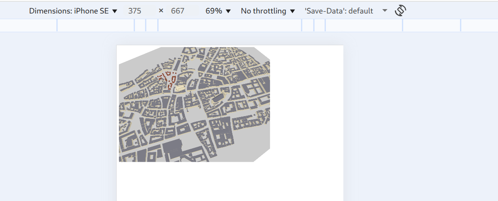
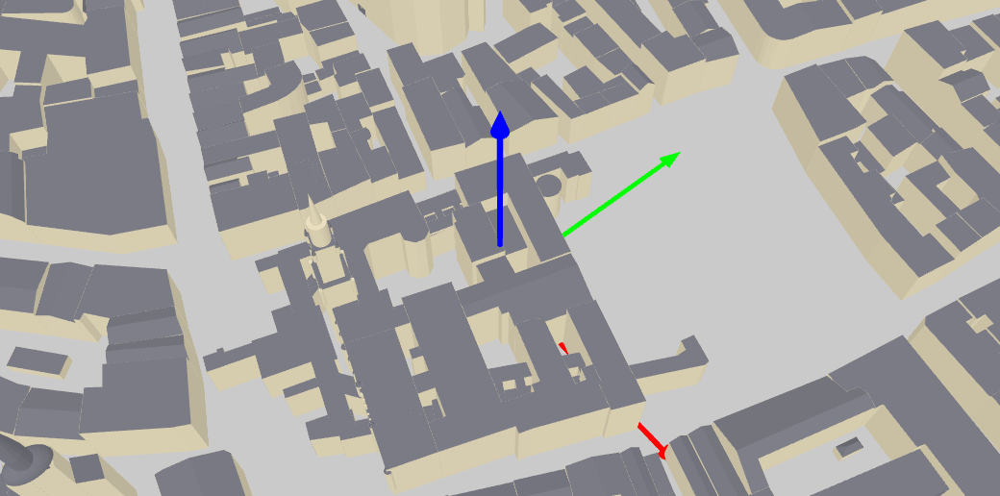
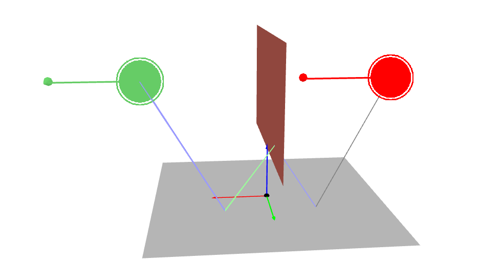

Sionna Utils
============

*Sionna's missing pieces, your unofficial Sionna toolkit.*


Introduction
------------

This package `sionna_utils` aim to provide some utility functions to
help user to adapt and debug issues on Sionna.

[Sionna](https://github.com/NVlabs/sionna) is a GPU-enabled research
platform for communication systems. But it missed some utilities to
help user to debug the issue, that's why I created `sionna_utils`.

Installation
------------

uv:

```
uv add git+https://github.com/mlouielu/sionna-utils
```

pip:

```
python -m pip install git+https://github.com/mlouielu/sionna-utils
```

Quick Examples
--------------

### Export scene to a standalone HTML file for 3D preview

```python
import sionna.rt
import sionna_utils

scene = sionna.rt.load_scene(sionna.rt.scene.munich)

# You can pass arguments for Scene.preview(), such as paths=paths
sionna_utils.utils.scene_export_html(
    scene, "preview.html", show_orientations=True
)
```

Open `preview.html` in browser:




### Add a coordinate frame in the scene


```python
import sionna.rt
import sionna_utils

scene = sionna.rt.load_scene(sionna.rt.scene.munich)

sionna_utils.geometry.create_coordinate_frame(
    scene, scale=100.0, position=[0, 0, 0])

sionna_utils.utils.scene_export_html(
    scene, "preview.html", show_orientations=True
)
```




### Fine-grain mask on paths object

Let's say if you want to visualize the paths, but only want to
visualize the paths that are 3-bounce path, you can combine
`sionna_utils.paths.get_paths_hit_sequence()` and
`sionna_utils.paths.get_path_depths()` to get the exact paths to
visualize it:

```python
import numpy as np

import sionna.rt
import mitsuba as mi
import sionna_utils
from sionna.rt import PlanarArray, Transmitter, Receiver, PathSolver

scene = sionna.rt.load_scene(sionna.rt.scene.floor_wall)
scene.tx_array = PlanarArray(
    num_rows=1,
    num_cols=2,
    pattern="tr38901",
    polarization="V",
)

# Configure antenna array for all receivers
scene.rx_array = PlanarArray(
    num_rows=1,
    num_cols=3,
    pattern="dipole",
    polarization="cross",
)

dist = 3
d = float(dist / np.sqrt(2))
scene.add(Transmitter(name="tx", position=[-d, 0, d]))
scene.add(Receiver(name="rx", position=[d, 0, d]))


for name, obj in scene.objects.items():
    obj.radio_material.scattering_coefficient = 0.1
    print(name, obj.object_id)


sionna_utils.geometry.create_coordinate_frame(scene, position=[0, 0, 0])

p_solver = PathSolver()
paths = p_solver(
    scene,
    max_depth=3,
    los=False,
    specular_reflection=True,
    diffuse_reflection=True,
    synthetic_array=False,
    seed=42,
)


depth_mask = sionna_utils.paths.get_path_depths(paths)
seq_mask = sionna_utils.paths.get_paths_hit_sequence(paths, [1, 2, 1], "per_link")
paths._valid = mi.TensorXb(paths.valid.numpy() & seq_mask & (depth_mask == 3))

sionna_utils.utils.scene_export_html(
    scene, "preview.html", show_orientations=True, paths=paths
)
```




LICENSE
-------

```
The Clear BSD License

Copyright (c) 2025 Louie Lu <louielu@cs.unc.edu>
All rights reserved.

Redistribution and use in source and binary forms, with or without
modification, are permitted (subject to the limitations in the disclaimer
below) provided that the following conditions are met:

     * Redistributions of source code must retain the above copyright notice,
     this list of conditions and the following disclaimer.

     * Redistributions in binary form must reproduce the above copyright
     notice, this list of conditions and the following disclaimer in the
     documentation and/or other materials provided with the distribution.

     * Neither the name of the copyright holder nor the names of its
     contributors may be used to endorse or promote products derived from this
     software without specific prior written permission.

NO EXPRESS OR IMPLIED LICENSES TO ANY PARTY'S PATENT RIGHTS ARE GRANTED BY
THIS LICENSE. THIS SOFTWARE IS PROVIDED BY THE COPYRIGHT HOLDERS AND
CONTRIBUTORS "AS IS" AND ANY EXPRESS OR IMPLIED WARRANTIES, INCLUDING, BUT NOT
LIMITED TO, THE IMPLIED WARRANTIES OF MERCHANTABILITY AND FITNESS FOR A
PARTICULAR PURPOSE ARE DISCLAIMED. IN NO EVENT SHALL THE COPYRIGHT HOLDER OR
CONTRIBUTORS BE LIABLE FOR ANY DIRECT, INDIRECT, INCIDENTAL, SPECIAL,
EXEMPLARY, OR CONSEQUENTIAL DAMAGES (INCLUDING, BUT NOT LIMITED TO,
PROCUREMENT OF SUBSTITUTE GOODS OR SERVICES; LOSS OF USE, DATA, OR PROFITS; OR
BUSINESS INTERRUPTION) HOWEVER CAUSED AND ON ANY THEORY OF LIABILITY, WHETHER
IN CONTRACT, STRICT LIABILITY, OR TORT (INCLUDING NEGLIGENCE OR OTHERWISE)
ARISING IN ANY WAY OUT OF THE USE OF THIS SOFTWARE, EVEN IF ADVISED OF THE
POSSIBILITY OF SUCH DAMAGE.
```
